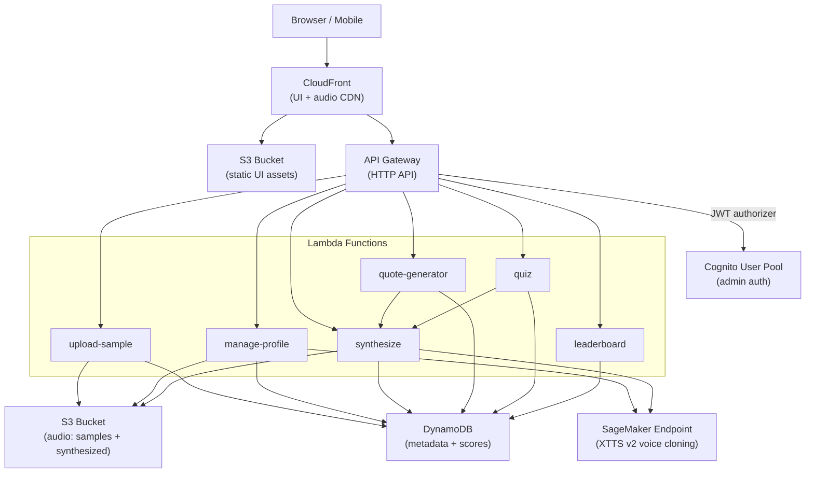
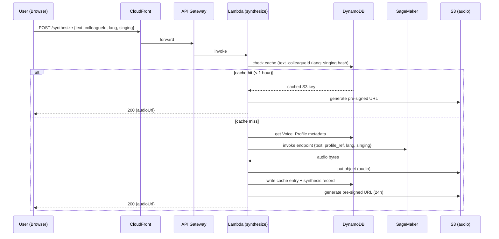
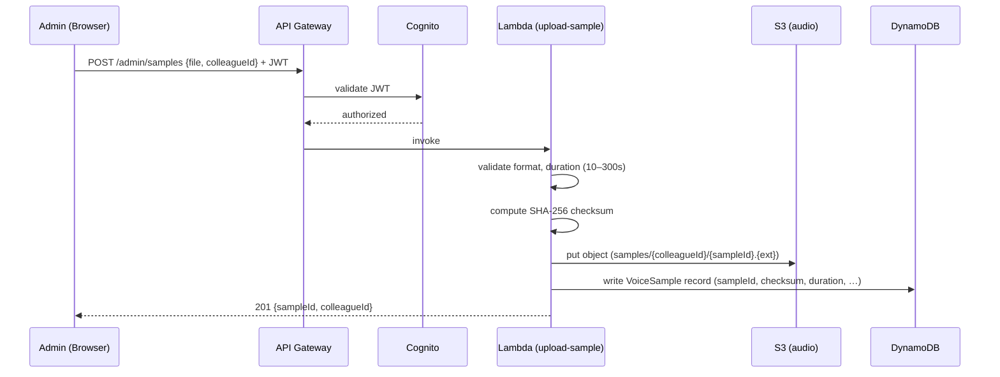

# Design Document: Colleague Voice Bot

## Overview

The Colleague Voice Bot is an AWS-hosted application that clones the voices of 7 colleagues from spoken meeting recordings and lets users synthesize speech, generate humorous quotes, play a voice-guessing quiz, and experiment with multilingual and singing modes — all through a browser-based UI.

The system is built entirely on AWS in **us-east-1** and follows a serverless-first architecture: API Gateway + Lambda for the API layer, SageMaker for the deep-learning voice cloning model, S3 for audio storage, DynamoDB for metadata and game state, and CloudFront for static asset and audio delivery.

### Design Goals

- **Low operational overhead**: serverless compute (Lambda) and managed services wherever possible.
- **Cost-proportional scaling**: synthesis is expensive; caching identical requests for 1 hour avoids redundant SageMaker invocations.
- **Security by default**: S3 buckets are fully private; audio is served only via pre-signed URLs; admin operations require Cognito JWT authentication.
- **Extensibility**: the colleague roster and quote library are data-driven, not hard-coded.

---

## Architecture

### High-Level AWS Service Topology



### Request Flow: Speech Synthesis



### Request Flow: Admin Upload



---

## Components and Interfaces

### Lambda Functions

| Function | Trigger | Auth | Responsibility |
|---|---|---|---|
| `upload-sample` | POST /admin/samples | Cognito JWT (admin) | Validate, store sample, write DDB record |
| `manage-profile` | POST /admin/profiles/{id}/build | Cognito JWT (admin) | Trigger SageMaker profile build, update status |
| `synthesize` | POST /synthesize | None | Cache check, invoke SageMaker, store audio, return URL |
| `quote-generator` | POST /quotes/random | None | Pick non-repeating quote, delegate to synthesize |
| `quiz` | POST /quiz/start, POST /quiz/answer | None | Manage quiz rounds, score evaluation |
| `leaderboard` | GET /leaderboard, POST /leaderboard | None | Read/write top-10 scores |

### API Gateway Routes

#### Admin Routes (Cognito JWT required)

| Method | Path | Lambda | Description |
|---|---|---|---|
| POST | /admin/samples | upload-sample | Upload a voice sample |
| DELETE | /admin/samples/{sampleId} | upload-sample | Delete a sample |
| POST | /admin/profiles/{colleagueId}/build | manage-profile | Trigger profile build |
| GET | /admin/profiles | manage-profile | List all profiles and statuses |
| DELETE | /admin/leaderboard/{entry} | leaderboard | Remove a leaderboard entry |

#### Public Routes (no auth)

| Method | Path | Lambda | Description |
|---|---|---|---|
| GET | /colleagues | manage-profile | List colleagues and profile statuses |
| POST | /synthesize | synthesize | Synthesize speech |
| POST | /quotes/random | quote-generator | Generate random quote audio |
| POST | /quiz/start | quiz | Start a quiz round |
| POST | /quiz/answer | quiz | Submit a quiz answer |
| GET | /leaderboard | leaderboard | Get top-10 leaderboard |
| POST | /leaderboard | leaderboard | Submit a score with nickname |

### SageMaker Endpoint Interface

The voice cloning model (Coqui XTTS v2 or equivalent) is deployed as a real-time SageMaker endpoint.

**Invocation payload (JSON):**
```json
{
  "text": "Hello, this is a test.",
  "speaker_wav_keys": ["samples/alice/s1.wav", "samples/alice/s2.wav"],
  "language": "en",
  "singing": false
}
```

**Response payload:**
```json
{
  "audio_base64": "<base64-encoded WAV>",
  "sample_rate": 24000,
  "duration_seconds": 2.4
}
```

The Lambda function decodes the base64 audio and writes it to S3. Speaker reference audio is fetched from S3 by the SageMaker container at inference time using an IAM role attached to the endpoint.

**Model container**: Custom Docker image pushed to ECR, based on the official Coqui XTTS v2 image. The container exposes a `/invocations` HTTP endpoint compatible with SageMaker's real-time inference protocol.

**Instance type**: `ml.g4dn.xlarge` (1× NVIDIA T4 GPU, sufficient for XTTS v2 inference latency < 5 s for typical inputs).

**Auto-scaling**: Scale-to-zero is not used (cold start is too slow for interactive use). A single instance is kept warm; scale-out to 2 instances can be triggered by CloudWatch alarm on `InvocationsPerInstance`.

### Cognito Configuration

- **User Pool**: `colleague-voice-bot-admins`
- **App Client**: server-side client (no client secret exposed to browser); token-based auth
- **Groups**: `admins` — membership required for admin endpoint access
- **JWT Authorizer**: API Gateway HTTP API JWT authorizer validates `iss` and `aud` claims; Lambda checks group membership for admin routes

### CloudFront Distribution

- **Origin 1**: S3 bucket (static UI assets) — served at `/`
- **Origin 2**: API Gateway — served at `/api/*` (path rewrite strips `/api` prefix)
- **Cache behavior for audio**: CloudFront does **not** cache pre-signed S3 URLs (TTL=0 on `/audio/*` path); the 24-hour validity is enforced by S3 pre-signed URL expiry
- **HTTPS only**: HTTP → HTTPS redirect enforced at CloudFront

---

## Data Models

### DynamoDB Tables

The system uses three DynamoDB tables with on-demand (PAY_PER_REQUEST) billing.

#### Table: `VoiceProfiles`

Stores colleague metadata and profile build status.

| Attribute | Type | Key | Description |
|---|---|---|---|
| `colleagueId` | String | PK | Unique identifier (e.g. `alice`) |
| `displayName` | String | — | Human-readable name |
| `status` | String | — | `pending` \| `processing` \| `ready` \| `failed` |
| `sampleKeys` | List\<String\> | — | S3 keys of associated voice samples |
| `profileRef` | String | — | Opaque reference passed to SageMaker (e.g. S3 prefix) |
| `errorDetails` | String | — | Error message if status = `failed` |
| `updatedAt` | String | — | ISO-8601 timestamp of last status change |
| `languages` | List\<String\> | — | Supported language codes (`en`, `fr`, `hi`) |

#### Table: `VoiceSamples`

Stores metadata for each uploaded audio sample.

| Attribute | Type | Key | Description |
|---|---|---|---|
| `sampleId` | String | PK | UUID v4 |
| `colleagueId` | String | GSI PK | Foreign key to VoiceProfiles |
| `s3Key` | String | — | Full S3 object key |
| `format` | String | — | `mp3` \| `wav` \| `m4a` |
| `durationSeconds` | Number | — | Audio duration in seconds |
| `checksum` | String | — | SHA-256 hex digest of raw file bytes |
| `uploadedAt` | String | — | ISO-8601 timestamp |
| `uploadedBy` | String | — | Cognito sub of uploading admin |

**GSI**: `ColleagueIndex` — PK: `colleagueId`, SK: `uploadedAt` (for listing samples per colleague)

#### Table: `SynthesisCache`

Caches synthesis results to avoid redundant SageMaker calls.

| Attribute | Type | Key | Description |
|---|---|---|---|
| `cacheKey` | String | PK | SHA-256 of `{text}:{colleagueId}:{lang}:{singing}` |
| `s3Key` | String | — | S3 key of the synthesized audio file |
| `createdAt` | Number | — | Unix epoch seconds (used for TTL) |
| `ttl` | Number | — | DynamoDB TTL attribute (epoch + 3600 s) |
| `durationSeconds` | Number | — | Audio duration |

DynamoDB TTL is enabled on the `ttl` attribute; expired entries are automatically deleted.

#### Table: `QuizScores`

Stores quiz game state and leaderboard entries.

| Attribute | Type | Key | Description |
|---|---|---|---|
| `entryId` | String | PK | UUID v4 |
| `nickname` | String | GSI PK | User-provided nickname |
| `score` | Number | — | Total correct guesses |
| `gamesPlayed` | Number | — | Total rounds played |
| `updatedAt` | String | — | ISO-8601 timestamp |

**GSI**: `LeaderboardIndex` — PK: `leaderboard` (constant `"global"`), SK: `score` (for top-10 query with `ScanIndexForward=false`, `Limit=10`)

> Implementation note: a sparse GSI with a constant PK is a standard DynamoDB pattern for leaderboards. The `leaderboard` attribute is set to `"global"` on every item.

#### Table: `QuoteLibrary`

Stores the pre-loaded quote library (≥ 50 quotes).

| Attribute | Type | Key | Description |
|---|---|---|---|
| `quoteId` | String | PK | UUID v4 |
| `text` | String | — | Quote text |
| `category` | String | — | `office` \| `meetings` \| `technology` \| `general` |
| `addedAt` | String | — | ISO-8601 timestamp |

Quote selection logic (avoid last-5 repetition per colleague) is maintained in a `RecentQuotes` sub-table or as a transient DynamoDB item keyed by `{colleagueId}:recent`.

### S3 Bucket Structure

**Bucket: `colleague-voice-bot-audio-{accountId}`** (private, versioning enabled)

```
samples/
  {colleagueId}/
    {sampleId}.{ext}          # uploaded voice samples

synthesized/
  {colleagueId}/
    {cacheKey}.wav            # synthesized speech output
```

**Bucket: `colleague-voice-bot-ui-{accountId}`** (private, served via CloudFront OAC)

```
index.html
assets/
  main.js
  main.css
  ...
```

### Cache Key Computation

```
cacheKey = SHA-256( lower(text) + ":" + colleagueId + ":" + lang + ":" + str(singing) )
```

Normalizing text to lowercase before hashing ensures that `"Hello"` and `"hello"` share a cache entry.

---

## Correctness Properties

*A property is a characteristic or behavior that should hold true across all valid executions of a system — essentially, a formal statement about what the system should do. Properties serve as the bridge between human-readable specifications and machine-verifiable correctness guarantees.*


### Property 1: Audio format validation

*For any* file upload request, the system SHALL accept the upload if and only if the file format is one of `mp3`, `wav`, or `m4a`; all other format strings SHALL be rejected with an error response.

**Validates: Requirements 1.1**

---

### Property 2: S3 key namespace invariant

*For any* successfully uploaded Voice_Sample with a given `colleagueId`, the stored S3 key SHALL start with the prefix `samples/{colleagueId}/`.

**Validates: Requirements 1.2**

---

### Property 3: Duration bounds validation

*For any* audio file upload, the system SHALL accept the upload if and only if the audio duration is in the range [10, 300] seconds (inclusive); files shorter than 10 s or longer than 300 s SHALL be rejected with a descriptive error message.

**Validates: Requirements 1.3, 1.4**

---

### Property 4: Sample count cap per colleague

*For any* colleague who already has 10 Voice_Samples stored, attempting to upload an additional sample SHALL be rejected; the sample count SHALL remain at 10.

**Validates: Requirements 1.5**

---

### Property 5: Upload response completeness

*For any* successful Voice_Sample upload, the response SHALL contain both a non-empty `sampleId` and the `colleagueId` that was provided in the request.

**Validates: Requirements 1.6**

---

### Property 6: Profile build status transitions

*For any* colleague, after triggering a Voice_Profile build:
- If the Voice_Cloning_Service returns success, the colleague's status in DynamoDB SHALL be `"ready"`.
- If the Voice_Cloning_Service returns an error, the colleague's status SHALL be `"failed"` and `errorDetails` SHALL be non-empty.

**Validates: Requirements 2.3, 2.4**

---

### Property 7: Profile build precondition

*For any* colleague with at least one Voice_Sample, triggering a Voice_Profile build SHALL succeed (return a non-error response); for any colleague with zero samples, the trigger SHALL be rejected.

**Validates: Requirements 2.1**

---

### Property 8: Synthesis text length validation

*For any* synthesis request (standard or language mode), the system SHALL accept the request if and only if the input text length is in the range [1, 500] characters (inclusive); texts outside this range SHALL be rejected with a descriptive error message.

**Validates: Requirements 3.3, 3.4**

---

### Property 9: Synthesis requires ready profile

*For any* synthesis request (standard, language, or singing mode) targeting a colleague whose Voice_Profile status is not `"ready"`, the system SHALL return an error response indicating the profile is unavailable.

**Validates: Requirements 3.2, 4.4**

---

### Property 10: Synthesis storage and URL round-trip

*For any* successful synthesis request, the system SHALL store the resulting audio in S3 and return a pre-signed URL that (a) contains the `X-Amz-Signature` query parameter and (b) allows retrieval of the stored audio object.

**Validates: Requirements 3.5, 7.4**

---

### Property 11: Synthesis caching idempotence

*For any* synthesis request (text, colleagueId, language, singing flag), submitting the identical request twice within a 1-hour window SHALL return the same S3 key in both responses, and the Voice_Cloning_Service SHALL be invoked exactly once across both requests.

**Validates: Requirements 3.6, 6.5**

---

### Property 12: Quote non-repetition

*For any* colleague and any sequence of 6 or more consecutive random quote requests for that colleague, no quote returned in position N shall have appeared in positions N-5 through N-1.

**Validates: Requirements 4.3**

---

### Property 13: Quote response completeness

*For any* successful random quote request, the response SHALL contain both a non-empty `quoteText` field and a non-empty `audioUrl` field.

**Validates: Requirements 4.5**

---

### Property 14: Language code validation

*For any* synthesis request with a `language` parameter, the system SHALL accept the request if and only if the language code is one of `"en"`, `"fr"`, or `"hi"`; all other language codes SHALL be rejected with a descriptive error message listing the supported codes.

**Validates: Requirements 6.2, 6.4**

---

### Property 15: Language parameter forwarding

*For any* synthesis request with a valid language code, the Voice_Cloning_Service SHALL be invoked with that exact language code in the request payload.

**Validates: Requirements 6.1, 6.3**

---

### Property 16: Singing mode text length validation

*For any* synthesis request with `singing=true`, the system SHALL accept the request if and only if the input text length is in the range [1, 200] characters (inclusive); texts outside this range SHALL be rejected with a descriptive error message.

**Validates: Requirements 7.2, 7.3**

---

### Property 17: Singing mode parameter forwarding

*For any* synthesis request with `singing=true`, the Voice_Cloning_Service SHALL be invoked with `singing=true` in the request payload.

**Validates: Requirements 7.1, 7.5**

---

### Property 18: Quiz round structure

*For any* quiz round, the response SHALL contain (a) exactly 7 answer options covering all colleague names, (b) a `mode` field with value `"spoken"` or `"singing"`, and (c) an audio URL for the clip.

**Validates: Requirements 5.2, 5.3, 7.6**

---

### Property 19: Quiz only selects ready colleagues

*For any* quiz start request, the colleague selected for the round SHALL have a `"ready"` Voice_Profile status in DynamoDB.

**Validates: Requirements 5.1**

---

### Property 20: Quiz evaluation correctness

*For any* quiz round with a known correct `colleagueId`, submitting a guess `g`:
- If `g == colleagueId`, the response SHALL indicate correct and the user's score SHALL increase by exactly 1.
- If `g != colleagueId`, the response SHALL indicate incorrect and SHALL include the correct colleague's name.

**Validates: Requirements 5.4, 5.5, 5.6**

---

### Property 21: Leaderboard ordering and completeness

*For any* leaderboard state, a GET /leaderboard request SHALL return at most 10 entries, each containing `nickname` and `score` fields, ordered by `score` descending.

**Validates: Requirements 5.7, 5.9**

---

### Property 22: Unauthenticated leaderboard submission

*For any* nickname and score, a POST /leaderboard request without an Authorization header SHALL succeed (return 2xx) and the entry SHALL be retrievable in DynamoDB.

**Validates: Requirements 5.8**

---

### Property 23: Admin endpoint authentication

*For any* admin endpoint, a request without a valid Cognito JWT SHALL receive an HTTP 401 response; a request with a valid JWT that lacks admin group membership SHALL receive an HTTP 403 response.

**Validates: Requirements 9.1, 9.2, 9.3**

---

### Property 24: Public endpoint accessibility

*For any* public endpoint (synthesis, quiz, leaderboard read/write), a request without an Authorization header SHALL not receive an HTTP 401 or 403 response.

**Validates: Requirements 9.4**

---

### Property 25: Pre-signed URL enforcement

*For any* synthesis response, the returned audio URL SHALL be a pre-signed S3 URL (containing `X-Amz-Signature` in the query string) rather than a public S3 URL.

**Validates: Requirements 9.6**

---

### Property 26: Voice sample storage round-trip

*For any* successfully uploaded Voice_Sample, retrieving the object from S3 using the stored `s3Key` SHALL return bytes identical to the uploaded file bytes.

**Validates: Requirements 10.1**

---

### Property 27: Checksum storage on upload

*For any* successfully uploaded Voice_Sample, the corresponding DynamoDB record SHALL contain a non-empty `checksum` field equal to the SHA-256 hex digest of the uploaded file bytes.

**Validates: Requirements 10.2**

---

### Property 28: Checksum integrity enforcement

*For any* Voice_Profile build request, if the SHA-256 digest of the retrieved sample file does not match the `checksum` stored in DynamoDB, the build SHALL be rejected with an error indicating data integrity failure; if the digests match, the build SHALL proceed normally.

**Validates: Requirements 10.3, 10.4**

---

## Error Handling

### Validation Errors (HTTP 400)

All input validation failures return a structured JSON error body:

```json
{
  "error": "VALIDATION_ERROR",
  "message": "Human-readable description",
  "field": "fieldName",
  "constraint": "e.g. maxLength=500"
}
```

| Scenario | HTTP Status | Error Code |
|---|---|---|
| Unsupported audio format | 400 | `INVALID_FORMAT` |
| Audio duration < 10 s | 400 | `DURATION_TOO_SHORT` |
| Audio duration > 300 s | 400 | `DURATION_TOO_LONG` |
| Text > 500 chars (standard) | 400 | `TEXT_TOO_LONG` |
| Text > 200 chars (singing) | 400 | `SINGING_TEXT_TOO_LONG` |
| Unsupported language code | 400 | `UNSUPPORTED_LANGUAGE` |
| Sample count would exceed 10 | 400 | `SAMPLE_LIMIT_EXCEEDED` |
| Empty text input | 400 | `TEXT_EMPTY` |

### Business Logic Errors (HTTP 409 / 422)

| Scenario | HTTP Status | Error Code |
|---|---|---|
| Profile not ready for synthesis | 422 | `PROFILE_NOT_READY` |
| Checksum mismatch on profile build | 409 | `CHECKSUM_MISMATCH` |
| Profile build already in progress | 409 | `BUILD_IN_PROGRESS` |

### Authentication / Authorization Errors

| Scenario | HTTP Status |
|---|---|
| Missing or invalid JWT on admin route | 401 |
| Valid JWT, missing admin group | 403 |

### Upstream Errors (HTTP 502 / 503)

- **SageMaker timeout or error**: Lambda catches the exception, updates profile status to `"failed"` (for build) or returns `502` (for synthesis), and logs the full error to CloudWatch Logs.
- **DynamoDB throttling**: Lambda uses exponential backoff with jitter (3 retries, base delay 100 ms). If all retries fail, returns `503` with `RETRY_LATER` error code.
- **S3 write failure**: Returns `502`; synthesis result is not cached.

### Lambda Error Handling Pattern

All Lambda functions follow a consistent try/catch pattern:

```javascript
exports.handler = async (event) => {
  try {
    const result = await handleRequest(event);
    return { statusCode: 200, body: JSON.stringify(result) };
  } catch (err) {
    if (err instanceof ValidationError) {
      return { statusCode: 400, body: JSON.stringify(err.toResponse()) };
    }
    if (err instanceof NotReadyError) {
      return { statusCode: 422, body: JSON.stringify(err.toResponse()) };
    }
    // Unexpected errors: log and return 500
    console.error('Unhandled error', err);
    return { statusCode: 500, body: JSON.stringify({ error: 'INTERNAL_ERROR' }) };
  }
};
```

---

## Testing Strategy

### Overview

The testing strategy uses a dual approach: **property-based tests** for universal correctness properties and **example-based unit/integration tests** for specific scenarios, UI behavior, and infrastructure checks.

### Property-Based Testing

**Library**: [fast-check](https://github.com/dubzzz/fast-check) (TypeScript/JavaScript)

**Configuration**: Each property test runs a minimum of **100 iterations** (configured via `fc.assert(fc.property(...), { numRuns: 100 })`).

**Tag format**: Each property test is tagged with a comment:
```
// Feature: colleague-voice-bot, Property N: <property_text>
```

**Scope**: Properties 1–28 (defined in the Correctness Properties section above) are each implemented as a single property-based test. SageMaker and DynamoDB calls are mocked using `aws-sdk-client-mock` to keep tests fast and cost-free.

**Example property test structure**:
```typescript
// Feature: colleague-voice-bot, Property 3: Duration bounds validation
it('rejects uploads outside [10, 300] second duration range', () => {
  fc.assert(
    fc.property(
      fc.oneof(
        fc.float({ min: 0, max: 9.99 }),       // too short
        fc.float({ min: 300.01, max: 3600 })   // too long
      ),
      (duration) => {
        const result = validateDuration(duration);
        expect(result.valid).toBe(false);
        expect(result.message).toBeTruthy();
      }
    ),
    { numRuns: 100 }
  );
});
```

### Unit Tests (Example-Based)

Unit tests cover:
- Specific examples for each Lambda handler (happy path + key error paths)
- UI component rendering: colleague card, audio player, quiz result animation, nickname modal, singing disclaimer
- Cache key computation (determinism, case normalization)
- Quote non-repetition logic (sliding window of 5)
- Leaderboard sort order with concrete score sets

### Integration Tests

Integration tests (run against a deployed dev environment or LocalStack) cover:
- End-to-end upload → profile build → synthesis flow (Requirements 2.2)
- SageMaker endpoint invocation with real payload structure
- DynamoDB TTL expiry behavior for cache entries
- CloudFront → API Gateway routing

### Smoke Tests

Smoke tests (run post-deployment) verify:
- CloudFront URL returns 200 with HTML (Requirement 8.1)
- S3 bucket public access block is enabled (Requirement 9.5)
- Exactly 7 colleague entries exist in VoiceProfiles table (Requirement 2.6)
- Quote library contains ≥ 50 entries (Requirement 4.2)
- SageMaker endpoint is InService

### Test File Organization

```
tests/
  unit/
    handlers/
      upload-sample.test.ts
      manage-profile.test.ts
      synthesize.test.ts
      quote-generator.test.ts
      quiz.test.ts
      leaderboard.test.ts
    utils/
      cache-key.test.ts
      checksum.test.ts
      duration-validation.test.ts
  property/
    upload-validation.property.test.ts
    synthesis.property.test.ts
    quiz.property.test.ts
    leaderboard.property.test.ts
    auth.property.test.ts
    integrity.property.test.ts
  integration/
    e2e-flow.test.ts
    sagemaker.test.ts
  smoke/
    deployment.smoke.test.ts
  ui/
    ColleagueCard.test.tsx
    AudioPlayer.test.tsx
    QuizResult.test.tsx
    NicknameModal.test.tsx
    SingingDisclaimer.test.tsx
```
